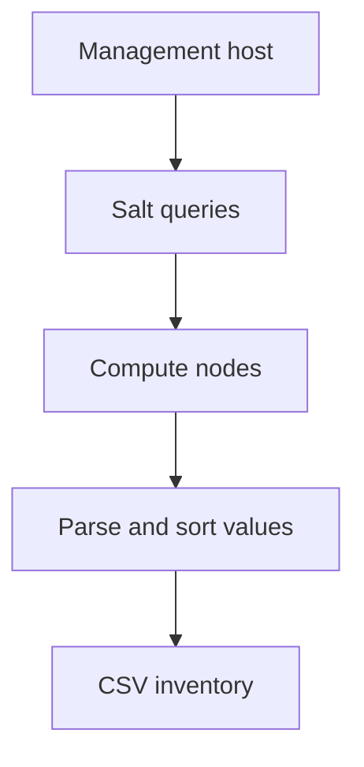

# OpenStack Undercloud Inventory Fetcher

A Bash utility that collects a consistent hardware and network inventory from
OpenStack compute nodes managed through Salt. It replaces repetitive manual
checks with a single CSV report suitable for audits, capacity reviews, and
maintenance planning.

> This is a sanitized portfolio version of an operations automation. It contains
> no customer data, production addresses, credentials, or proprietary output.

## What it collects

| CSV column | Source |
|---|---|
| Compute | Salt minion name |
| VLAN IP | Linux interface address |
| BMC IP | `ipmitool lan print` |
| Bridge IP | Linux bridge address |
| BIOS | `dmidecode` |
| BMC firmware | `ipmitool mc info` |
| Serial number | `dmidecode` |

## Why I built it

Infrastructure inventory was previously gathered node by node. That approach
was slow and could produce inconsistent records. This script queries all target
compute nodes, aligns results by hostname, substitutes `#N/A` for missing data,
and produces one repeatable report.

## Requirements

- Bash 4+
- Salt CLI access from the management/undercloud host
- `sudo` access on target nodes for `ip`, `ipmitool`, and `dmidecode`
- GNU `grep`, `sort`, `awk`, and `paste`

## Quick start

```bash
chmod +x undercloud_inventory.sh
./undercloud_inventory.sh
```

Optional configuration:

```bash
./undercloud_inventory.sh \
  --target '*compute*' \
  --vlan-interface vlan1 \
  --bridge br-all \
  --output inventory.csv
```

Run `./undercloud_inventory.sh --help` for all options.

## Synthetic sample output

```csv
Compute,VLAN IP,BMC IP,Bridge IP,BIOS,BMC Firmware,Serial Number
compute-0,192.0.2.10/24,198.51.100.10,203.0.113.10/24,2.8.0,4.10,SAMPLE001
compute-1,192.0.2.11/24,198.51.100.11,203.0.113.11/24,2.8.0,4.10,SAMPLE002
```

The addresses above use IANA documentation ranges and are not production data.

## Workflow



## Safety and limitations

- Review the target expression before running in any environment.
- The tool is read-only on target nodes, but it executes privileged inspection commands.
- Column alignment assumes every Salt response includes its minion name.
- Validate the generated CSV before using it as an authoritative asset record.

## Validation

The GitHub Actions workflow runs `bash -n`, ShellCheck, and a synthetic smoke test
on every push and pull request.

## License

[MIT](LICENSE)
